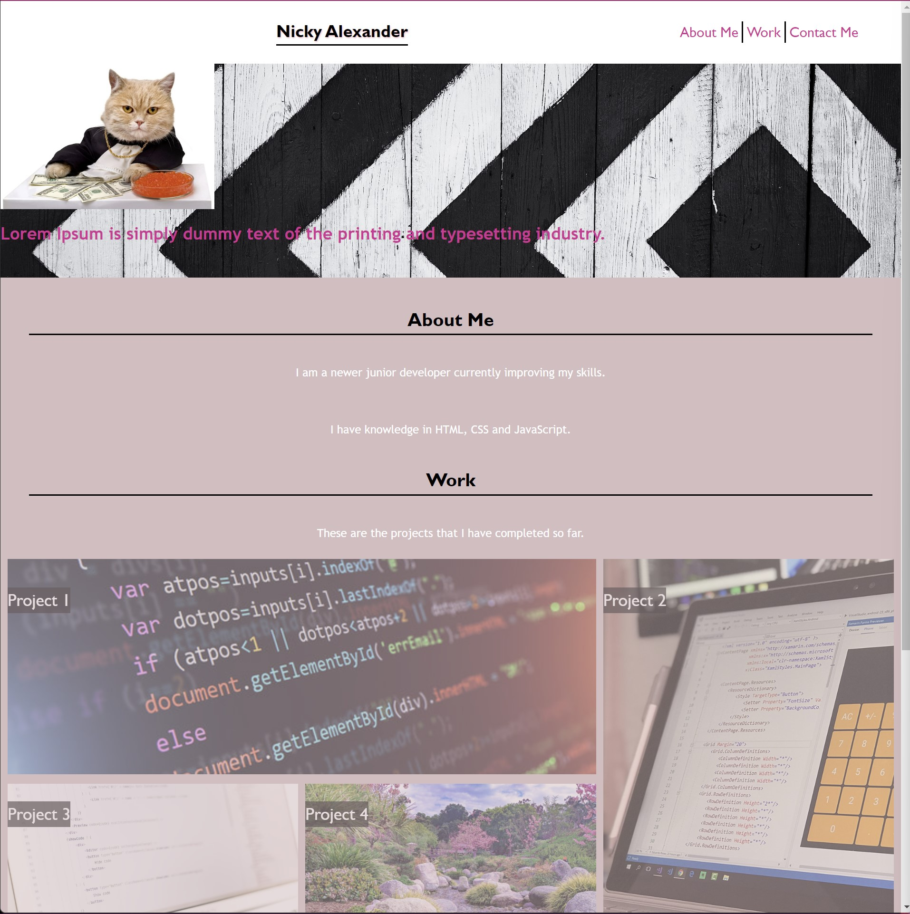
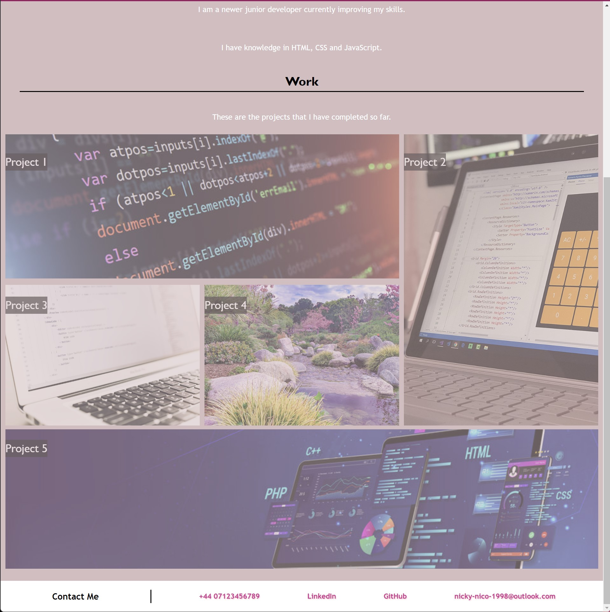
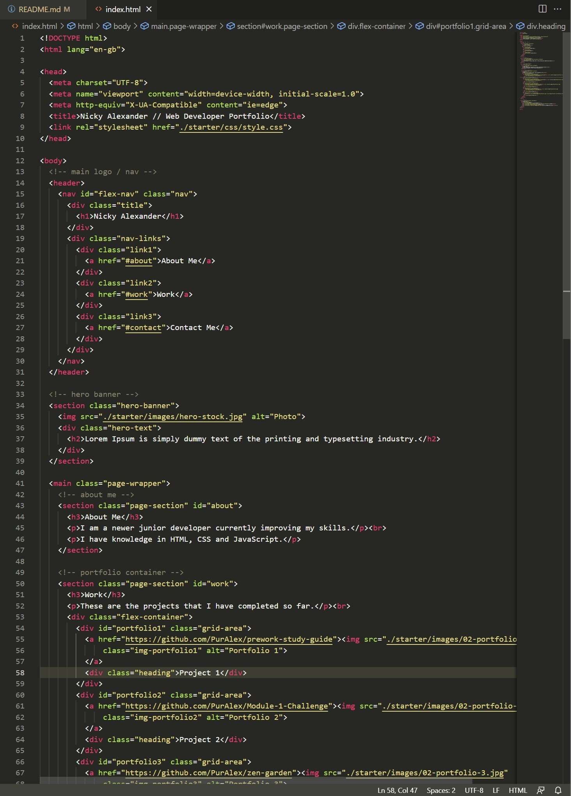
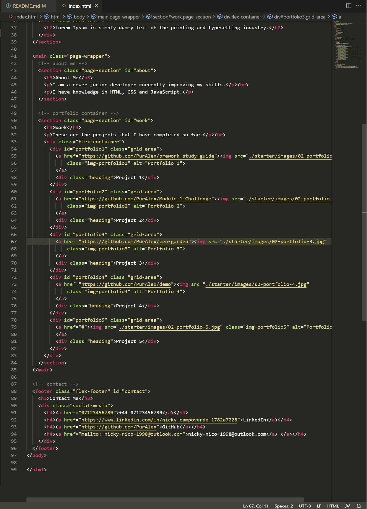
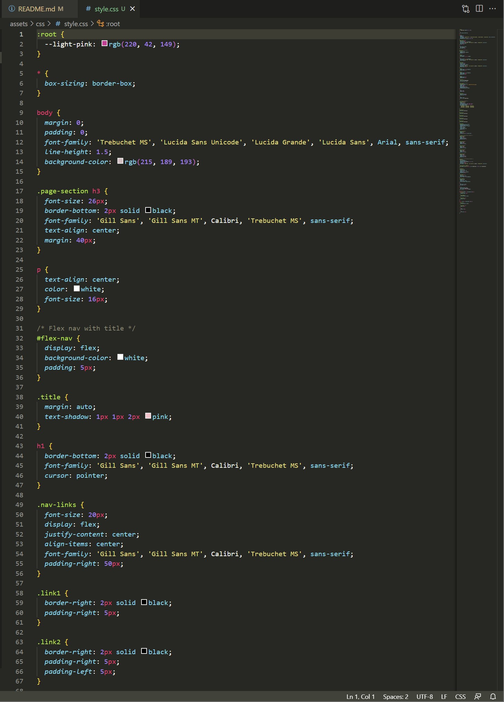
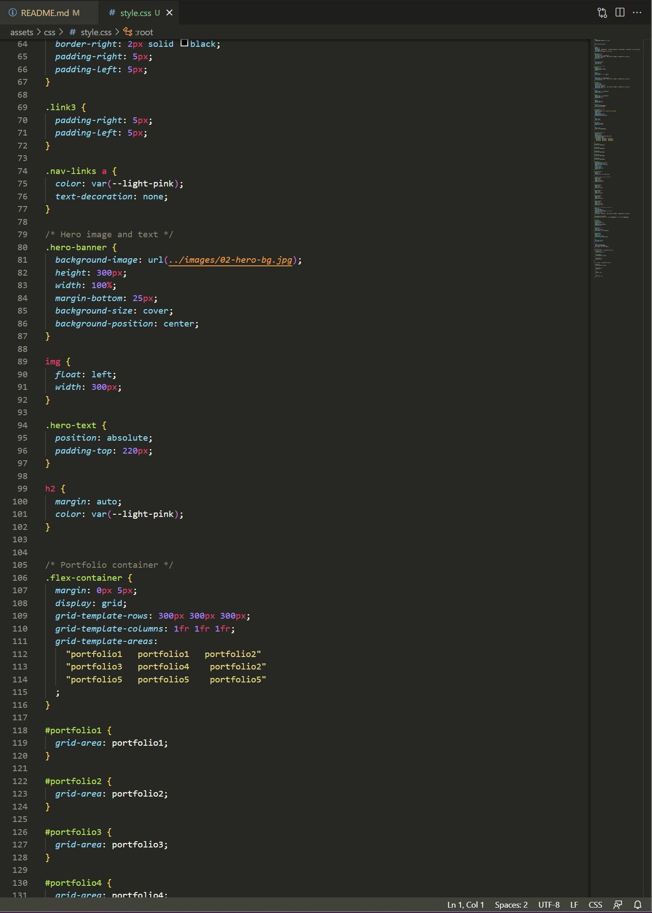
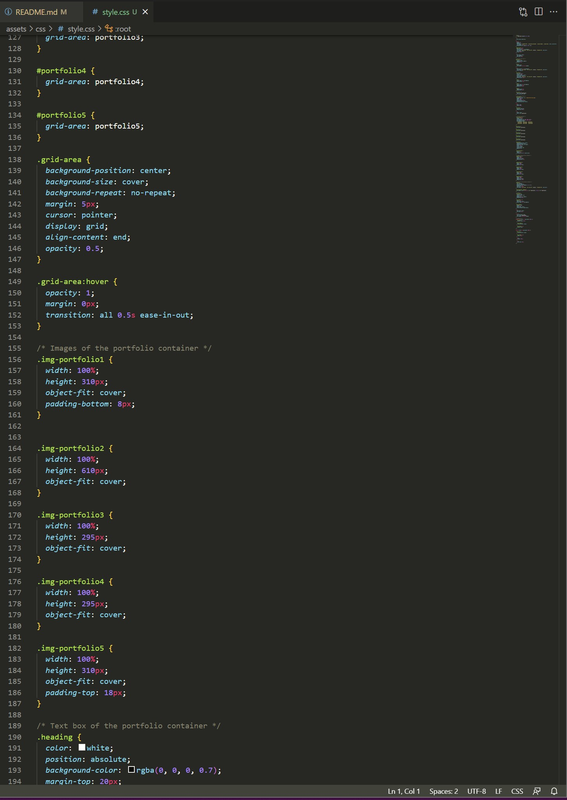
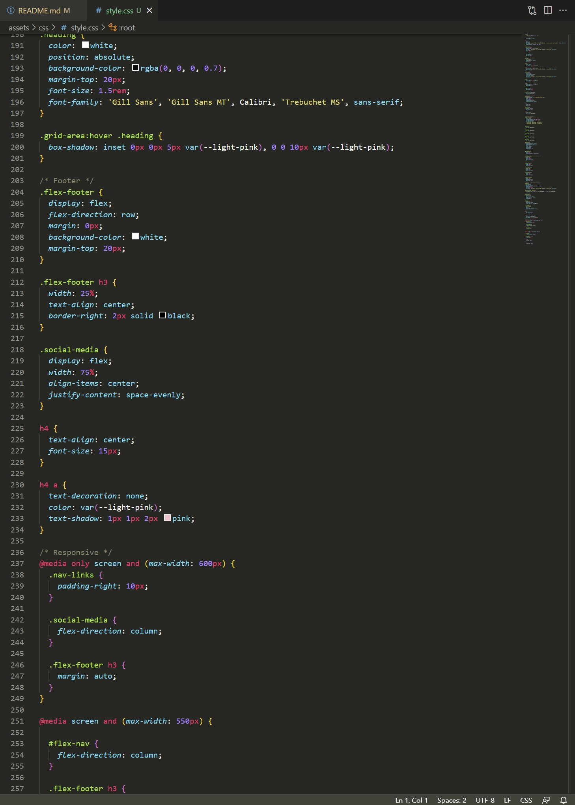
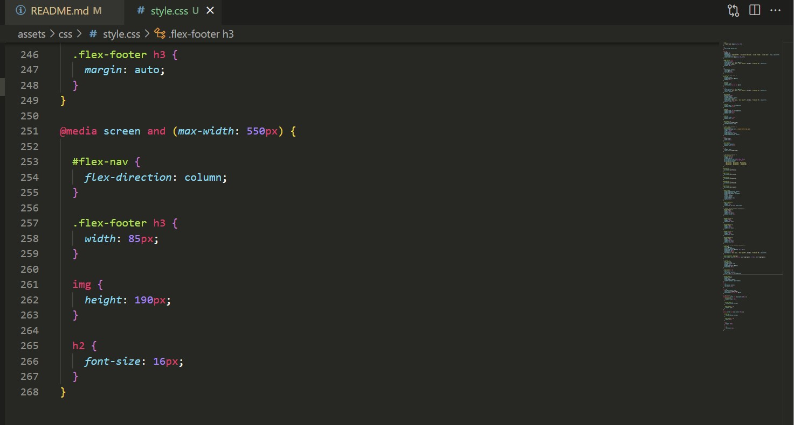

# Portfolio

## Description

I created my **portfolio** to show the skills that I learned so far. I will improve the code while I improve and learn more skills.
As I don't have projects to show I link each project of the porfolio to some of my GitHub repositoies and for the 5th project I used a placeholder. The website is completely resposive to any device.

This project was challenging because I wasn't very familiarise with grid area and I found hard to add a link to the images. The good thing is that I learn more of grid area and I feel more confident with it.

## Screenshots

This is how the portfolio looks like.

The following screenshots are the HTML and CSS coding.

## Installation

N/A

## Usage

To access my portfolio [click here](https://puralex.github.io/Portfolio/)

## Credits

I used [w3schools](https://www.w3schools.com/) and [css-tricks](https://css-tricks.com/) to help me with some properties.

## Features

HTML and CSS were used to developed the website.

## Contributing

N/A

## Tests

While writing the code I made tests to make sure the website works properly.

## Lincese

License under the MIT license.